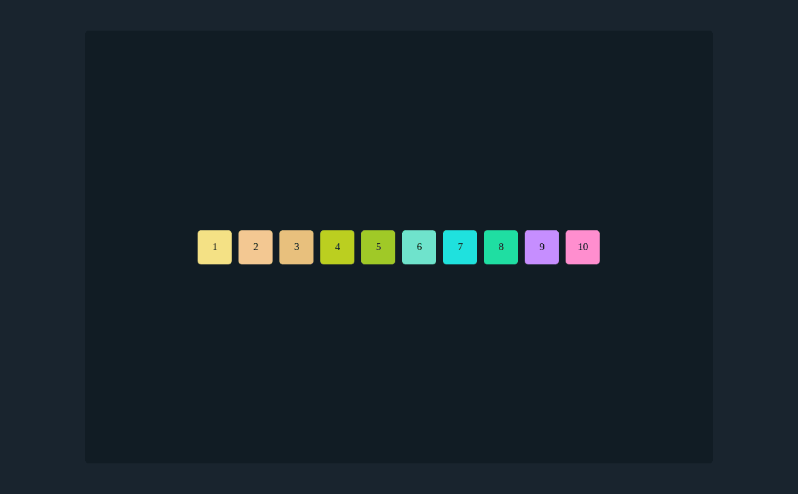
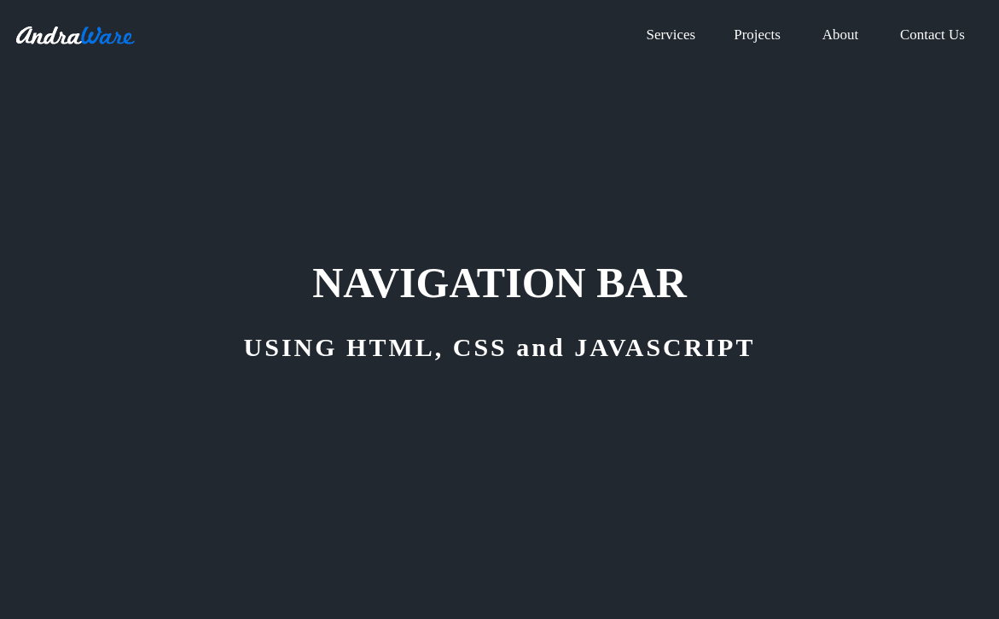
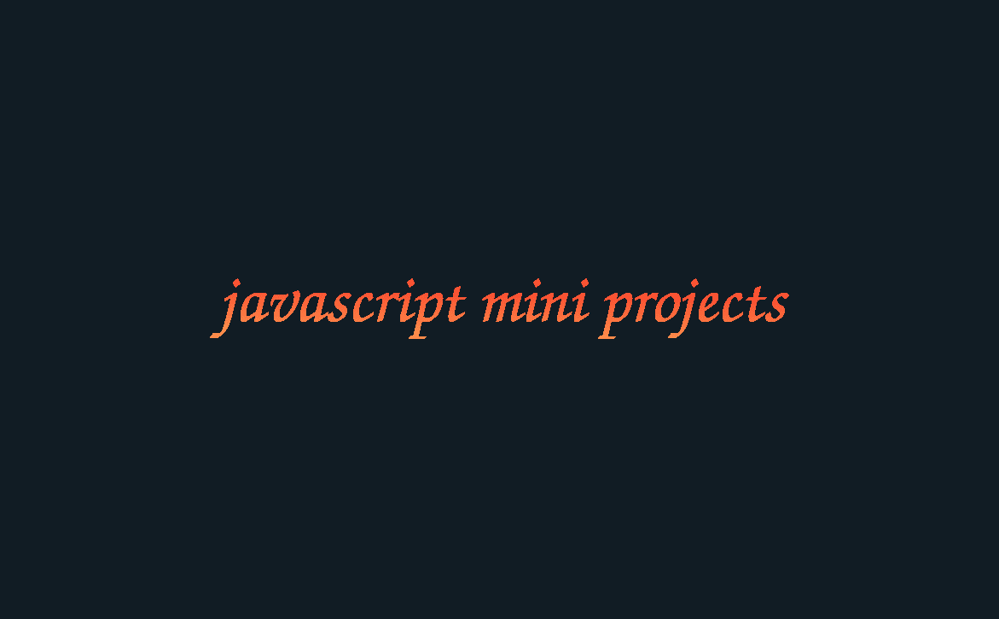
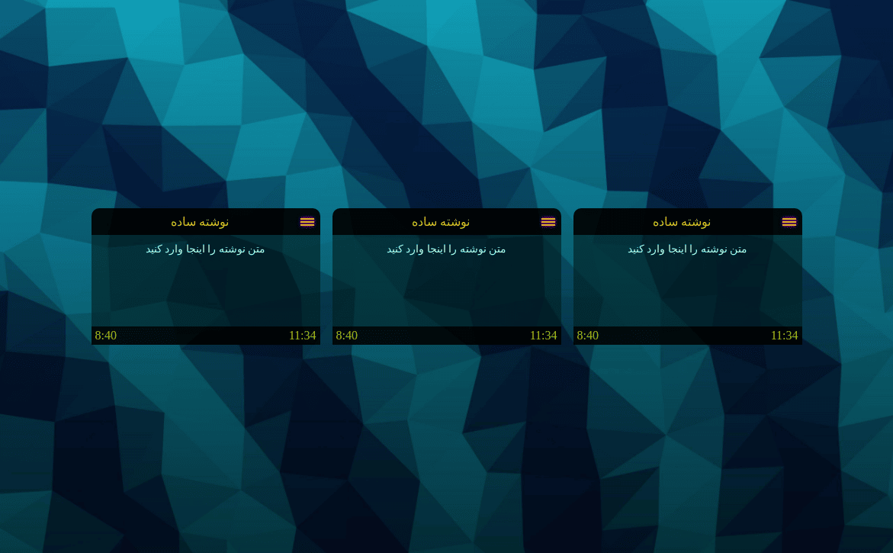
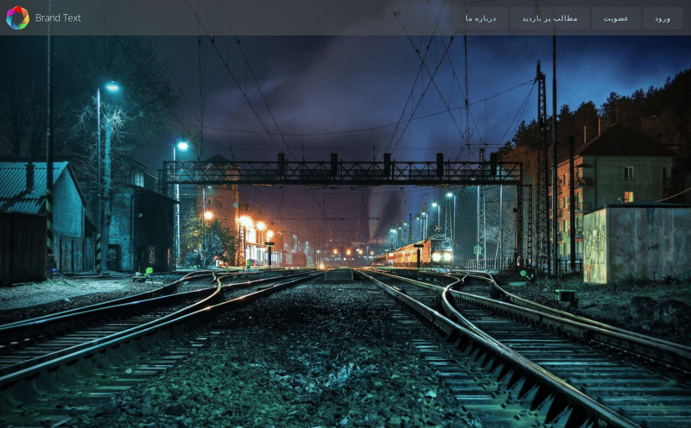
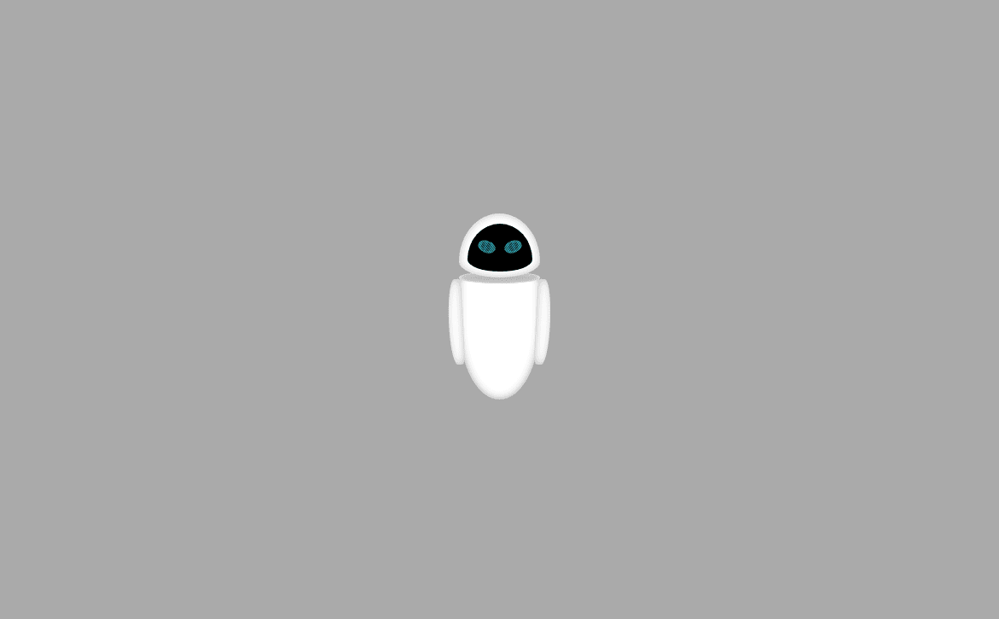
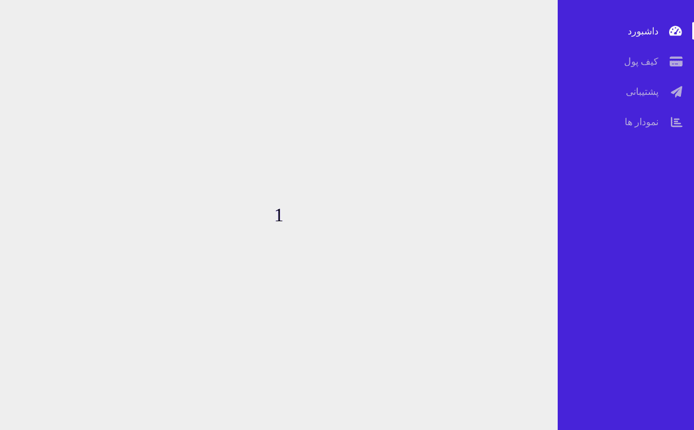
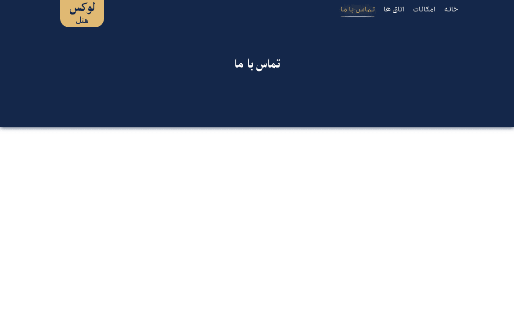
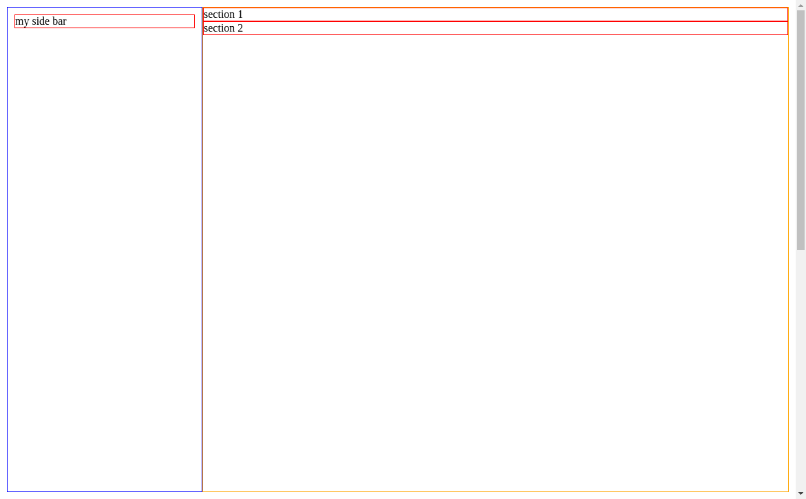

# frontend mini projects

<!-- css flexbox kit -->

<a href="https://devshashtag.github.io/mini-frontend/projects/css-flexbox-kit" target="_blank">
  
a kit for learning css flexbox

</a>

 

<!-- main header -->

<a href="https://devshashtag.github.io/mini-frontend/projects/css-main-header" target="_blank">
  
full screen header

</a>

 

<!-- javascript mini -->

<a href="https://github.com/devshashtag/mini-frontend/tree/main/projects/javascript-mini" target="_blank">
  
javascript mini projects

</a>

 

<!-- note app -->

<a href="https://devshashtag.github.io/mini-frontend/projects/css-note-app" target="_blank">
  
css note app

</a>

 

<!-- rsesponsive navbar -->

<a href="https://devshashtag.github.io/mini-frontend/projects/css-responsive-navbar" target="_blank">
  
css responsive navbar

</a>

 

<!-- css eve -->

<a href="https://devshashtag.github.io/mini-frontend/projects/css-eve" target="_blank">
  
css eve

</a>

 

<!-- sidebar menu -->

<a href="https://devshashtag.github.io/mini-frontend/projects/css-sidebar-menu" target="_blank">
  
a sidebar menu that controls the content

</a>

 

<!-- luxury hotels header -->

<a href="https://devshashtag.github.io/mini-frontend/projects/css-luxury-hotels-header" target="_blank">
  
simple header exported from luxury hotels project

</a>

 

<!-- sosition nticky yelative eo oarent -->

<a href="https://devshashtag.github.io/mini-frontend/projects/css-position-sticky-relative-to-parent" target="_blank">
  
css position sticky relative to parent

</a>
