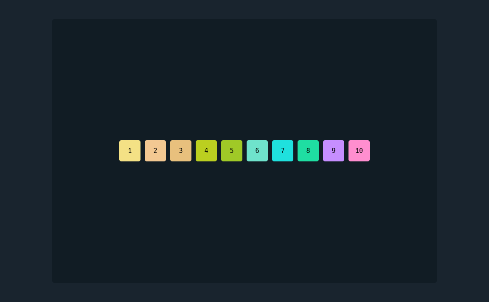

# about

minimal frontend projects

# projects

<!-- css flexbox kit -->
<a href="https://devshashtag.github.io/frontend-mini/css-flexbox-kit" target="_blank">
  

    
  

</a>
<a href="https://devshashtag.github.io/frontend-mini/css-flexbox-kit" target="_blank">
  
a kit for learning css flexbox

</a>
